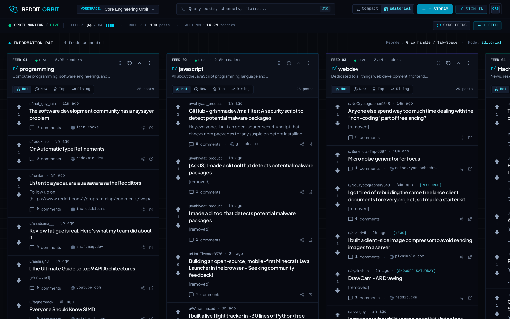
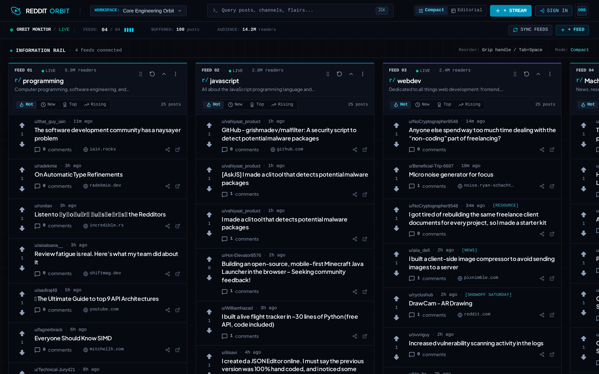
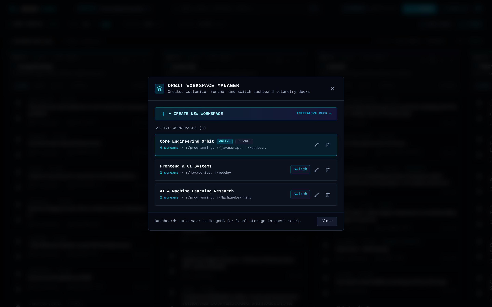
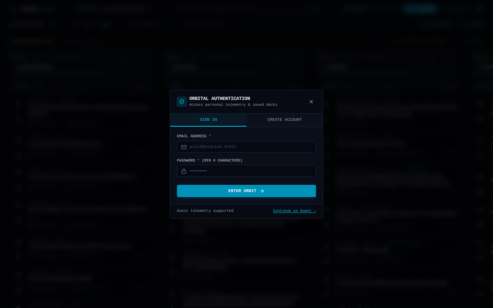
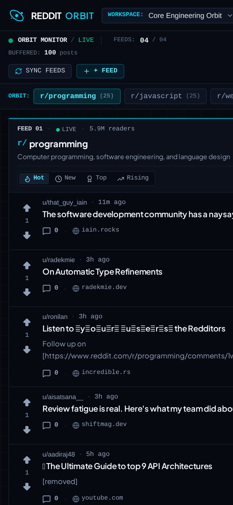

# Reddit Orbit — Personal Information Command Center

Reddit Orbit is a high-density, multi-stream personal information workspace built for software engineers, systems operators, and researchers. It transforms Reddit from a single-column, algorithmic doomscrolling feed into a parallel multi-column monitoring console, allowing users to track multiple technical communities side-by-side in custom workspaces.

Designed with a **technical + editorial + information-dense + premium** visual language, Reddit Orbit operates in zero-configuration guest mode (persisted to `localStorage`) and seamlessly bridges to authenticated cloud storage on **MongoDB Atlas** with interactive conflict resolution.

---

## Table of Contents

1. [Project Overview](#1-project-overview)
2. [Problem Statement](#2-problem-statement)
3. [Features](#3-features)
4. [Screenshots](#4-screenshots)
5. [Architecture Diagram](#5-architecture-diagram)
6. [Tech Stack & Design Rationale](#6-tech-stack--design-rationale)
7. [Frontend Architecture](#7-frontend-architecture)
8. [Backend Architecture](#8-backend-architecture)
9. [Database Design](#9-database-design)
10. [API Documentation](#10-api-documentation)
11. [Authentication Flow](#11-authentication-flow)
12. [Caching Strategy](#12-caching-strategy)
13. [Error Handling](#13-error-handling)
14. [Local Development Setup](#14-local-development-setup)
15. [Environment Variables](#15-environment-variables)
16. [Deployment Instructions](#16-deployment-instructions)
17. [Security Considerations](#17-security-considerations)
18. [Future Improvements](#18-future-improvements)

---

## 1. Project Overview

Reddit is home to some of the world's most vibrant developer and engineering discussions across thousands of subreddits (`r/programming`, `r/devops`, `r/kubernetes`, `r/machinelearning`, `r/rust`, etc.). However, monitoring multiple technical channels traditionally requires juggling dozens of browser tabs or relying on algorithmic feeds that mix entertainment with critical signals.

**Reddit Orbit** addresses this by providing:
- **Parallel Stream Lanes**: Horizontal channel rails monitoring live Reddit posts simultaneously.
- **Precision Drag-and-Drop (`@dnd-kit`)**: Reorder observation lanes using mouse, touch, or accessible keyboard navigation.
- **Multiple Workspaces**: Create, switch, rename, and delete custom decks (e.g. *DevOps Radar*, *AI & LLMs*, *Frontend Architecture*).
- **Dual-Mode Persistence**: Fully resilient in local anonymous guest sessions, with automatic conflict analysis and three-way merging (`[Use Local]`, `[Use Cloud]`, `[Merge]`) upon pilot sign-in.
- **Information-Dense Editorial Aesthetics**: Unboxed metadata, tabular numerals, live carrier beacons, hairline alignment rails, and instant density toggling (Compact vs. Editorial).

---

## 2. Problem Statement

Modern web information consumers face three major friction points when monitoring Reddit:

1. **Algorithmic Dilution & Single-Column Bottlenecks**: The standard Reddit interface presents content in a vertical, single-channel feed optimized for consumer engagement and infinite scroll, rather than information velocity.
2. **Context Switching Friction**: Cross-referencing discussions across related ecosystems (e.g., investigating a cloud outage across `r/aws`, `r/sysadmin`, and `r/devops`) requires manually opening and refreshing multiple tabs.
3. **Fragile Synchronization**: Users who curate dashboards on one workstation lose their configuration when moving to another device, or face silent overwrites when logging in.

Reddit Orbit solves these problems with a multi-column command canvas, server-side caching proxy, and conflict-aware cloud synchronization.

---

## 3. Features

### Personal Information Streams
- **Horizontal Lane Architecture**: Monitor an arbitrary number of subreddits in parallel lanes.
- **Real-Time Data Feed**: Fetches live posts from the Reddit JSON API with server-side proxy fallback.
- **Sorting & Time Ranges**: Instant switching between `Hot`, `New`, `Top` (with Day/Week/Month/Year/All filters), and `Rising`.
- **Stream Activity & Live Carrier Beads**: Rhythmic status indicators reflecting live carrier health, synchronization freshness, and audience volume.
- **Collapse & Expand**: Fold inactive streams into ultra-compact vertical channel pillars displaying vertical identifiers, unread badges, and status beacons.

### Advanced Customization
- **Drag-and-Drop Reordering**: Powered by `@dnd-kit` with `horizontalListSortingStrategy`, tactile grip handles, and high-tech glowing drag overlays.
- **Multi-Device Sensor Support**:
  - **Mouse**: 5px distance constraint prevents misclicks on header buttons.
  - **Touch**: 150ms delay with 5px tolerance ensures fluid scrolling without triggering accidental reorders.
  - **Keyboard**: Accessible reordering via `Tab`, `Space` to pick up, `ArrowLeft`/`ArrowRight` to shift positions, and `Space`/`Enter` to drop.
- **Multi-Dashboard Management**:
  - Create new workspaces from scratch, copy current streams, or load presets.
  - Inline and modal deck renaming.
  - Workspace deletion with automatic fallback switching.
  - Quick-switch dropdown in the header with live feed count badges.

### Session Resilience & Cloud Synchronization
- **Anonymous Guest Mode**: Full dashboard customization, column reordering, and post viewing work immediately without signing up.
- **Conflict-Aware Synchronization ("Sync Your Orbit")**: When an anonymous user signs in or registers, Orbit inspects local streams against MongoDB Atlas. If differences are detected, the user is presented with a non-destructive choice:
  - `[Use Local]`: Overwrites cloud workspace with local guest configuration.
  - `[Use Cloud]`: Restores cloud workspace onto local client.
  - `[Merge]`: Combines unique streams from both sources without duplicates.
- **Automatic Cloud Auto-Save**: All lane additions, reordering, collapse toggles, and sorting selections auto-save to MongoDB Atlas for authenticated users.

### High-Velocity Navigation & Inspection
- **Post Density Toggle**:
  - **Compact**: Dense, single-line headline view maximizing visible information density.
  - **Editorial**: Rich typography with comfortable reading rhythm, text snippets, and domain kickers.
- **Global Command Search (`Cmd+K` / `Ctrl+K`)**: Rapidly filter buffered posts by title, author, or flair, with smooth auto-scroll to the parent stream.
- **Workspace Manager Modal (`Cmd+M` / `Ctrl+M`)**: Direct keyboard access to deck management.
- **Post Detail Inspector**: Deep inspection drawer featuring author badges, upvote deltas, external domain previews, and sanitized markdown rendering.

---

## 4. Screenshots

The following high-resolution PNG screenshots are captured directly from the running application:

### 1. Main Dashboard — Editorial Information Rail
*Multi-stream observation canvas displaying real-time feeds with status telemetry, live carrier beads, and technical metadata.*



---

### 2. High-Density Compact Mode
*Compact density view maximizing visible information across parallel columns for high-velocity triage.*



---

### 3. Workspace Deck Manager (`Cmd+M`)
*Deck customization interface for creating, renaming, switching, and deleting multiple independent dashboards.*



---

### 4. Pilot Authentication & Cloud Sync
*Secure authentication dialog connecting guest telemetry decks to persistent MongoDB Atlas storage.*



---

### 5. Mobile Responsive View
*Single-column active channel inspection with horizontal channel switcher on narrow screens (<1024px).*



---

## 5. Architecture Diagram

```
+-----------------------------------------------------------------------------------+
|                                 CLIENT LAYER                                      |
|                                                                                   |
|  +------------------------+  +------------------------+  +---------------------+  |
|  |  React 19 View Rail    |  |   @dnd-kit Engine      |  | AuthContext & State |  |
|  |  - StreamLane          |  |   - PointerSensor      |  | - User JWT Token    |  |
|  |  - SortableStreamLane  |  |   - TouchSensor        |  | - Login Event Hook  |  |
|  |  - PostCard (Density)  |  |   - KeyboardSensor     |  | - Guest Fallback    |  |
|  +-----------+------------+  +-----------+------------+  +----------+----------+  |
|              |                           |                          |             |
|              +---------------------------+--------------------------+             |
|                                          |                                        |
|                       Client Services & HTTP Client                               |
|              (redditService, dashboardSyncService, dashboardManagerService)       |
+------------------------------------------+----------------------------------------+
                                           |
                               HTTP / JSON | (Bearer JWT / Local Storage)
                                           v
+-----------------------------------------------------------------------------------+
|                            GATEWAY & SERVER LAYER                                 |
|                                                                                   |
|  +-----------------------------------------------------------------------------+  |
|  | Express 4 HTTP Application (server.ts / server/app.ts)                       |  |
|  | - CORS Middleware (credentials: true)                                       |  |
|  | - IP Sliding Window Rate Limiter (120 req / 60s)                            |  |
|  | - Centralized Error Handler (AppError)                                      |  |
|  +-----------------------------------------------------------------------------+  |
|       |                                |                               |          |
|       v                                v                               v          |
|  [ /api/subreddits ]            [ /api/dashboards ]             [ /api/auth ]     |
|  - SubredditController          - DashboardController           - AuthController  |
|  - SubredditValidator           - AuthMiddleware (JWT)          - Bcrypt Hash     |
+-------+--------------------------------+-------------------------------+----------+
        |                                |                               |
        v                                v                               v
+------------------+           +--------------------+          +--------------------+
|  IN-MEMORY CACHE |           |  DASHBOARD SERVICE |          |    AUTH SERVICE    |
|  - LRU Storage   |           |  - CRUD Dashboards |          |  - JWT Sign/Verify |
|  - 5-min TTL     |           |  - Stream Reorder  |          |  - Mongo Queries   |
+-------+----------+           +---------+----------+          +---------+----------+
        |                                |                               |
        v                                v                               v
+------------------+           +----------------------------------------------------+
| REDDIT JSON API  |           |                MONGODB ATLAS                       |
| (Upstream Proxy) |           | - `users` Collection (Unique Email, Bcrypt Hash)   |
|                  |           | - `dashboards` Collection (User Decks & Streams)   |
+------------------+           +----------------------------------------------------+
```

---

## 6. Tech Stack & Design Rationale

| Layer | Technology | Architectural Rationale |
|---|---|---|
| **Frontend Framework** | **React 19** | Zero-latency virtual DOM reconciliation, modern hooks (`useRef`, `useState`, `useCallback`), and concurrent rendering for multi-column post updates. |
| **Bundler & Dev Server** | **Vite 8** | Instantaneous hot-module reloading and optimized ES module bundling mounted via Express middleware in development. |
| **Drag & Drop** | **@dnd-kit** (`@dnd-kit/core`, `@dnd-kit/sortable`, `@dnd-kit/utilities`) | Lightweight modular drag-and-drop toolkit. Chosen over legacy HTML5 drag or heavy alternatives because it decouples sensor input (mouse, touch, keyboard) from DOM rendering and supports smooth horizontal layout transforms. |
| **Typography & Icons** | **Plus Jakarta Sans**, **JetBrains Mono**, **Lucide React** | Editorial, high-readability sans face paired with monospace tabular numerals for metrics and consistent technical iconography. |
| **Styling** | **Tailwind CSS v4** | Pure utility-first styling with zero runtime overhead; custom hairline grid patterns, deep obsidian color system, and responsive breakpoints. |
| **Backend Framework** | **Express 4.21** | Minimalist, predictable Node.js HTTP server. Easily mounts Vite dev middleware in development and serves pre-built static assets in production. |
| **Database & ODM** | **MongoDB Atlas + Mongoose 9** | Document-oriented storage is natively suited for flexible stream configurations, ordered sub-documents, and user preferences. |
| **Authentication** | **JSON Web Tokens (JWT) + bcryptjs** | Stateless bearer authentication enabling zero-session server scalability with salted password hashing (12 rounds). |
| **Type Safety** | **TypeScript 7** | Shared type definitions across client and server (`SubredditStream`, `NormalizedPost`, `UserDashboard`, `ApiError`). |

---

## 7. Frontend Architecture

The frontend follows a modular, decoupled architecture where UI components remain purely visual while state orchestration and persistence reside in dedicated service layers:

```
src/
├── components/               # Pure & Connected UI Components
│   ├── Header.tsx            # Navigation, Workspace selector, Density toggle, Auth trigger
│   ├── DashboardStatus.tsx   # Live telemetry status bar, active feeds counter, sync trigger
│   ├── StreamLane.tsx        # Single subreddit column with sorting tabs and action menus
│   ├── SortableStreamLane.tsx# dnd-kit useSortable wrapper providing drag handles & transforms
│   ├── PostCard.tsx          # Editorial & Compact density post representation
│   ├── AddStreamModal.tsx    # Subreddit directory search and custom community connection
│   ├── SearchModal.tsx       # Cmd+K global buffered post query drawer
│   ├── DashboardManagerModal.tsx # Multi-dashboard creator, deck renamer, and switcher
│   ├── SyncOrbitModal.tsx    # Anonymous-to-authenticated conflict resolution dialog
│   └── PostDetailModal.tsx   # Deep inspection drawer for post body, media, and external URLs
├── context/
│   └── AuthContext.tsx       # JWT state, user payload, loginEvent emitter, and modal triggers
├── services/
│   ├── redditService.ts      # Client-side Reddit fetcher with proxy failover and in-memory TTL
│   ├── dashboardSyncService.ts# Analysis of local vs cloud streams and three-way merge logic
│   └── dashboardManagerService.ts # LocalStorage and MongoDB CRUD dispatcher for dashboards
├── types/
│   ├── orbit.ts              # SubredditStream, UserDashboard, SortOption, StreamDensity
│   └── reddit.ts             # NormalizedPost, RedditRawListing, PaginationInfo
└── utils/
    └── formatters.ts         # Tabular audience formatters (K/M), relative time ago
```

### Drag-and-Drop Implementation
The drag-and-drop system avoids converting streams into generic cards. Instead, the entire stream lane column maintains its integrity:
- **`SortableStreamLane`**: Invokes `useSortable({ id: stream.id })` and applies CSS transform matrices.
- **Sensor Coordination**:
  ```ts
  const sensors = useSensors(
    useSensor(PointerSensor, { activationConstraint: { distance: 5 } }),
    useSensor(TouchSensor, { activationConstraint: { delay: 150, tolerance: 5 } }),
    useSensor(KeyboardSensor, { coordinateGetter: sortableKeyboardCoordinates })
  );
  ```
- **Tactical Drag Overlay**: An active drag item clone is rendered inside `<DragOverlay>` with a subtle cyan border glow (`ring-1 ring-cyan-400 border-cyan-400 shadow-2xl`), giving immediate visual feedback without layout jumps.

---

## 8. Backend Architecture

The backend is structured under an Express MVC (Model-View-Controller) service pattern:

```
server/
├── config/index.ts           # Centralized environment variable validation
├── controllers/
│   ├── authController.ts     # User registration, login, and profile introspection
│   ├── subredditController.ts# Subreddit post querying, listing normalization, and proxying
│   └── dashboardController.ts# Dashboard CRUD, stream reordering, and default workspace assignment
├── db/
│   ├── connection.ts         # Mongoose connection manager with resilient offline fallback
│   └── models/
│       ├── User.ts           # User account schema with bcrypt password hashing
│       └── Dashboard.ts      # Multi-stream dashboard configuration schema
├── middleware/
│   ├── auth.ts               # Bearer JWT verification and user payload injection
│   ├── cors.ts               # Cross-Origin Resource Sharing with credentials support
│   ├── errorHandler.ts       # Centralized JSON error serialization
│   ├── rateLimiter.ts        # Sliding-window IP rate limiter
│   └── validateRequest.ts    # Input schema validation middleware
├── routes/
│   ├── authRoutes.ts         # /api/auth endpoints
│   ├── subredditRoutes.ts    # /api/subreddits endpoints
│   └── dashboardRoutes.ts    # /api/dashboards endpoints
└── services/
    ├── authService.ts        # Password comparison, JWT issuance, user querying
    ├── cacheService.ts       # In-memory LRU cache for upstream Reddit responses
    ├── dashboardService.ts   # MongoDB dashboard operations and default deck initialization
    └── redditService.ts      # Upstream Reddit JSON fetcher with User-Agent rotation
```

---

## 9. Database Design

Reddit Orbit uses MongoDB Atlas with two primary Mongoose schemas:

### 1. `User` Schema (`users` collection)
Stores pilot credentials and profile information:

```typescript
{
  _id: ObjectId,
  email: { type: String, required: true, unique: true, lowercase: true, index: true },
  passwordHash: { type: String, required: true },
  name: { type: String, required: true },
  username: { type: String, sparse: true, index: true },
  role: { type: String, enum: ['pilot', 'admin'], default: 'pilot' },
  avatarUrl: { type: String },
  createdAt: ISODate,
  updatedAt: ISODate
}
```

### 2. `Dashboard` Schema (`dashboards` collection)
Stores workspace decks and embedded stream lane specifications:

```typescript
{
  _id: ObjectId,
  userId: { type ObjectId, ref: 'User', required: true, index: true },
  name: { type: String, required: true, trim: true },
  description: { type: String, trim: true },
  isDefault: { type: Boolean, default: false },
  streams: [
    {
      _id: ObjectId,
      subreddit: { type: String, required: true, lowercase: true },
      position: { type: Number, required: true, default: 0 },
      sort: { type: String, enum: ['hot', 'new', 'top', 'rising'], default: 'hot' },
      timeRange: { type: String, enum: ['day', 'week', 'month', 'year', 'all'], default: 'day' },
      postLimit: { type: Number, default: 25 },
      collapsed: { type: Boolean, default: false }
    }
  ],
  createdAt: ISODate,
  updatedAt: ISODate
}
```

#### Indexing Strategy
- `users`: Unique compound index on `{ email: 1 }`.
- `dashboards`: Compound index on `{ userId: 1, isDefault: -1 }` for rapid retrieval of the pilot's primary deck upon authentication.

---

## 10. API Documentation

All endpoints return standardized JSON payloads:
```json
{
  "success": true,
  "data": { ... },
  "message": "Optional status message"
}
```

### Authentication Endpoints

| Method | Endpoint | Description | Auth Required |
|---|---|---|---|
| `POST` | `/api/auth/register` | Register a new pilot account (`email`, `password`, `name`, `username?`). | No |
| `POST` | `/api/auth/login` | Authenticate pilot credentials (`email`, `password`) and obtain Bearer JWT. | No |
| `GET` | `/api/auth/me` | Retrieve authenticated pilot identity and active session metadata. | Yes |

### Subreddit Stream Endpoints

| Method | Endpoint | Description | Query Parameters |
|---|---|---|---|
| `GET` | `/api/subreddits/:name/posts` | Query normalized posts for a subreddit. | `sort` (hot/new/top/rising), `timeRange` (day/week/etc.), `limit` (1-100), `after` |
| `GET` | `/api/subreddits/:name` | Query metadata, subscriber count, active users, and icon for a subreddit. | None |

### Dashboard Management Endpoints

| Method | Endpoint | Description | Auth Required |
|---|---|---|---|
| `GET` | `/api/dashboards` | List all saved dashboards for the authenticated pilot. | Yes |
| `POST` | `/api/dashboards` | Create a new custom workspace deck. | Yes |
| `GET` | `/api/dashboards/:id` | Retrieve a specific dashboard deck by ID. | Yes |
| `PUT` | `/api/dashboards/:id` | Update dashboard name, streams array, ordering, or default status. | Yes |
| `DELETE` | `/api/dashboards/:id` | Delete a dashboard deck. | Yes |

### Health Check Endpoint
- **`GET /api/health`**: Returns system uptime, timestamp, and MongoDB Atlas connectivity status.

---

## 11. Authentication Flow

```
[Pilot Enters Credentials] 
         │
         ▼
[POST /api/auth/login] ────► [Bcrypt Password Verification]
                                     │ (Valid)
                                     ▼
                          [Sign JWT (7-Day Expiry)]
                                     │
                                     ▼
                       [Return Token & User Payload]
                                     │
         ┌───────────────────────────┴───────────────────────────┐
         ▼                                                       ▼
[Store Token in localStorage]                         [Emit Login Event]
         │                                                       │
         ▼                                                       ▼
[Set Auth State & User Pill]                          [Trigger Sync Analysis]
                                                                 │
                                         ┌───────────────────────┴───────────────────────┐
                                         ▼                                               ▼
                              [Differences Found?]                              [No Conflicts?]
                                         │                                               │
                                         ▼ (Yes)                                         ▼
                            [Open "Sync Your Orbit" Modal]                     [Auto-Link Cloud Deck]
                                         │
                 ┌───────────────────────┼───────────────────────┐
                 ▼                       ▼                       ▼
            [Use Local]             [Use Cloud]               [Merge]
                 │                       │                       │
                 ▼                       ▼                       ▼
      [Overwrite MongoDB Deck]   [Overwrite Local Streams]  [Combine Unique Feeds]
                 │                       │                       │
                 └───────────────────────┴───────────────────────┘
                                         │
                                         ▼
                        [Save Final State to MongoDB Atlas]
```

---

## 12. Caching Strategy

Reddit enforces strict rate limits on public feeds. Reddit Orbit uses a two-tier caching architecture to prevent 429 throttling and ensure instantaneous column rendering:

### Tier 1: Client-Side LRU Memory Cache
- Cached in `redditService.ts` via an in-memory map keyed by `${subName}:${sort}:${timeRange}`.
- Enforces a 60-second client-side TTL. If a user quickly switches sorting tabs back and forth, the data resolves in `0ms` without making duplicate network requests.

### Tier 2: Server-Side In-Memory Cache with Stale-While-Revalidate
- Managed by `CacheService` in Express.
- Key format: `reddit:posts:${subreddit}:${sort}:${timeRange}:${limit}:${after || ''}`.
- Cache duration: **5 minutes (300 seconds)** with a maximum size of 500 entries.
- When a stream request arrives:
  1. If cached and fresh: Serves cached JSON immediately.
  2. If cache has expired: Fetches updated data from Reddit upstream, normalizes the payload, updates cache, and responds.
  3. If Reddit upstream returns a transient 504/429 error: Serves the stale cached version with a `stale: true` flag rather than failing.

---

## 13. Error Handling

Reddit Orbit follows a fail-soft engineering philosophy where one failing stream never crashes neighboring streams or the dashboard:

1. **Per-Stream Isolation**:
   - Each `StreamLane` manages its own independent `error` state.
   - If `r/some_private_sub` returns a `403 Forbidden` or `404 Not Found`, only that lane displays a localized *"Unable to Load Stream"* card with a single-click retry button. Neighboring columns continue streaming uninterrupted.
2. **Centralized Backend `AppError`**:
   - The server routes all operational errors through an `AppError` class with structured codes (`VALIDATION_ERROR`, `UNAUTHORIZED`, `NOT_FOUND`, `RATE_LIMIT_EXCEEDED`, `REDDIT_UPSTREAM_ERROR`).
3. **Database Offline Resilience**:
   - If the MongoDB Atlas connection string is absent or temporarily unreachable during startup, the server logs a warning and gracefully operates in resilient offline mode instead of terminating the process.

---

## 14. Local Development Setup

### Prerequisites
- **Node.js**: v20.0.0 or higher
- **npm** or **bun**

### Step-by-Step Installation

1. **Clone the Repository**:
   ```bash
   git clone https://github.com/your-username/reddit-orbit.git
   cd reddit-orbit
   ```

2. **Install Dependencies**:
   ```bash
   npm install
   ```

3. **Configure Environment Variables**:
   ```bash
   cp .env.example .env
   ```
   *Edit `.env` and provide your MongoDB Atlas connection string and JWT secret (see Section 15).*

4. **Start the Development Server**:
   ```bash
   npm run dev
   ```
   *This starts the Express backend and Vite middleware on `http://localhost:3000`.*

5. **Verify the Build**:
   ```bash
   npm run lint
   npm run build
   ```

---

## 15. Environment Variables

Create a `.env` file in the project root:

```ini
# Server Configuration
PORT=3000
NODE_ENV=development

# Database (MongoDB Atlas)
MONGODB_URI=mongodb+srv://<username>:<password>@<cluster>.mongodb.net/reddit_orbit?retryWrites=true&w=majority

# Authentication
JWT_SECRET=super_secret_orbit_jwt_key_at_least_32_characters_long
JWT_EXPIRES_IN=7d

# Upstream Reddit API
REDDIT_USER_AGENT=web:reddit-orbit:v1.0.0 (by /u/reddit_orbit_app)

# Rate Limiting
RATE_LIMIT_WINDOW_MS=60000
RATE_LIMIT_MAX_REQUESTS=120

# Development Controls
DISABLE_HMR=true
```

---

## 16. Deployment Instructions

### Production Build & Launch

Reddit Orbit compiles into a production-ready Node.js bundle:

1. **Compile Frontend Assets**:
   ```bash
   npm run build
   ```
   *This generates optimized production assets in `/dist`.*

2. **Run in Production Mode**:
   ```bash
   npm start
   ```
   *`server.ts` detects `NODE_ENV=production`, mounts Express static file serving for `/dist`, and serves API routes under `/api/*`.*

### Containerization (Dockerfile)

```dockerfile
FROM node:22-alpine AS builder
WORKDIR /app
COPY package*.json ./
RUN npm ci
COPY . .
RUN npm run build

FROM node:22-alpine AS runner
WORKDIR /app
ENV NODE_ENV=production
ENV PORT=3000
COPY package*.json ./
RUN npm ci --only=production
COPY --from=builder /app/dist ./dist
COPY --from=builder /app/server ./server
COPY --from=builder /app/server.ts ./server.ts
COPY --from=builder /app/tsconfig.json ./tsconfig.json

EXPOSE 3000
CMD ["npm", "start"]
```

---

## 17. Security Considerations

1. **Password Security**: Passwords are never stored in plaintext. They are salted and hashed using `bcryptjs` with a work factor of 12 before being written to MongoDB.
2. **Stateless JWT Verification**: All `/api/dashboards` routes require a valid `Authorization: Bearer <token>` header. Token signatures are validated cryptographically against `JWT_SECRET`.
3. **Cross-Site Scripting (XSS) Prevention**: Raw HTML from Reddit selftext posts and comments is never injected directly with `dangerouslySetInnerHTML`. Content is normalized, and external URLs are validated with `rel="noopener noreferrer"`.
4. **Input Validation**: Subreddit names and query strings are sanitized with regular expressions (`/^[a-zA-Z0-9_]{3,21}$/`) to reject malformed parameters before reaching upstream services.
5. **No Secret Leakage**: The client never receives API credentials or database connection strings. All upstream requests flow through server-side controller proxies.

---

## 18. Future Improvements

The following architectural enhancements are planned for subsequent milestones:

1. **Reddit OAuth2 User Authorization**: Allow users to authenticate their personal Reddit accounts to cast live upvotes/downvotes and save posts directly from Orbit.
2. **WebSocket Live Post Ticker**: Stream new posts directly to lane headers via a real-time WebSocket connection.
3. **Custom Flair & Keyword Rules**: Support client-side regex rules to auto-hide or highlight posts matching specific keywords.
4. **Export / Import Dashboard Configurations**: Support JSON export and import of workspace layouts for team sharing.
